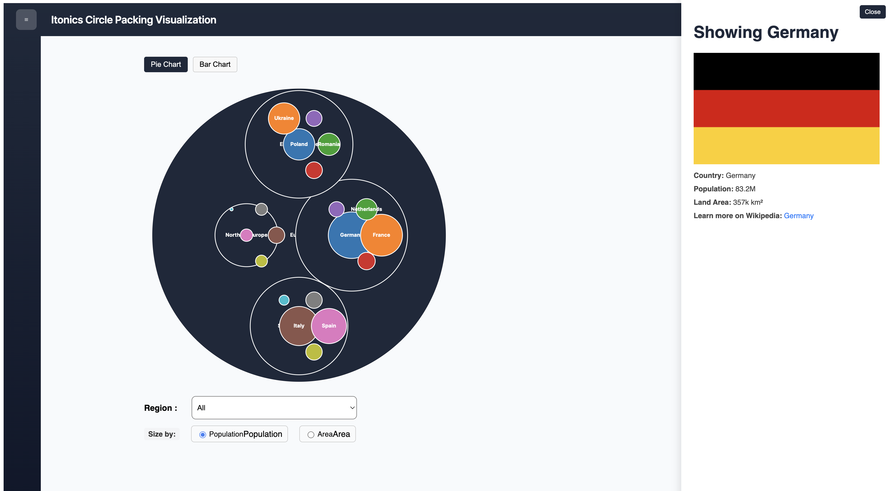

# 🟢 Circle Packing Visualisation



**CirclePackingVisualisation** is an interactive data visualization app built with Angular 16 and D3.js 7.9.0, leveraging NgRx for state management. It visualizes hierarchical data using a responsive and animated [circle packing](https://observablehq.com/@d3/circle-packing) layout.

---

## 📐 Architecture

- **Framework**: [Angular 16](https://angular.io/) for application structure and component-based UI
- **Visualization**: [D3.js v7](https://d3js.org/) for efficient, low-level rendering of SVG-based hierarchical layouts
- **State Management**: [NgRx](https://ngrx.io/) for predictable, scalable app state
- **Reactive Programming**: [RxJS](https://rxjs.dev/) for managing UI async streams
- **Build Tooling**: Angular CLI with TypeScript 5.1.x, using strict type safety and incremental compilation

---

## 🚀 Getting Started

```bash
git clone https://github.com/BradMotech/circle-packing-visualization.git
cd circle-packing-visualisation
npm install
npm start
```

## 🚀 Project Architecture
```
src/
├── app/
│   ├── core/       # Core modules and singletons (models)
│   ├── features/dashboard/components/circle-packing      # Feature-specific D3 visualisation components
│   ├── shared/components      # Reusable visual components (d3-renderers, UI)
│   ├── shared/pipes      # Reusable data transformation pipes
│   ├── components/       # Reusable visual components (d3-renderers, UI)
│   ├── state/            # NgRx feature slices (actions, reducers, effects)
│   └── app.module.ts     # Root module
├── assets/               # Static assets (flags, datasets, icons)
└── index.html            # Application shell
```

## 🚀 Commands to use

| Script          | Purpose                           |
| --------------- | --------------------------------- |
| `npm start`     | Dev server at `localhost:4200`    |
| `npm run build` | Production build to `/dist`       |
| `npm run test`  | Run unit tests via Karma          |
| `npm run watch` | Rebuild on file change (dev mode) |

## 🚀 Tech stack used

| Dependency    | Version   |
| ------------- | --------- |
| Angular       | 16.2.x    |
| D3.js         | ^7.9.0    |
| NgRx          | ^15.4.0   |
| TypeScript    | \~5.1.3   |
| Jasmine/Karma | \~4.6/6.4 |
| Zone.js       | \~0.13.0  |
